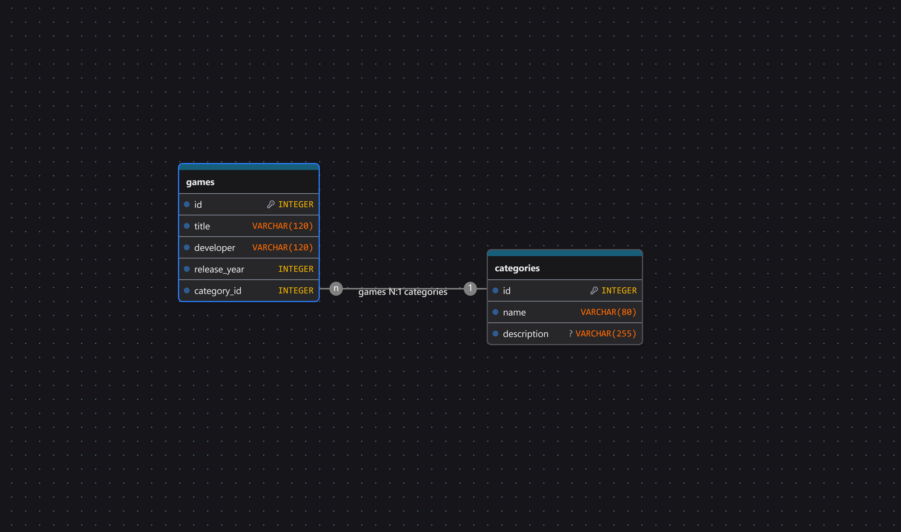

# GameHub API

GameHub API is a web application designed to manage a database of video games. It allows users to create, modify, and delete video game entries.

Each entry includes the following information:

- Title.
- Release date.
- Genre.
- Publisher.

## Features

- Create new video game entries.
- View stored video games.
- Modify existing entries.
- Delete video game entries.
- Store data in a SQLite database.
- Communicate with the backend through an API.

## Technologies Used

### Frontend

- HTML5.
- CSS3.
- JavaScript.
- Axios.

### Backend

- Python.
- FastAPI.
- SQLite.
- SQLAlchemy.

### Package Management

- pip.

### Development Tools

- Visual Studio Code: IDE.
- Git: project's version management.
- GitHub: project's repository maintenance.

### Prototyping

- v0: used for designing website's prototype.
- DrawDB: used for designing the database's structure.

### Artificial Intelligence

- ChatGPT, used for code-related questions and assistance

## Database Diagram



## Project Structure

```
VGDB-API/
├── frontend/
│   ├── css/
│   │   ├── atom/
│   │   ├── molecule/
│   │   ├── organism/
│   │   ├── page/
│   │   ├── template/
│   │   └── *.css
│   └── js/
│       └── *.js
│   └── index.html
├── backend/
│   ├── config/
│   ├── controller/
│   ├── database/
│   ├── model/
│   ├── routes/
│   ├── schema/
│   └── main.py
├── docs/
│   └── diagram.png
├── requirements.txt
└── README.md
```
